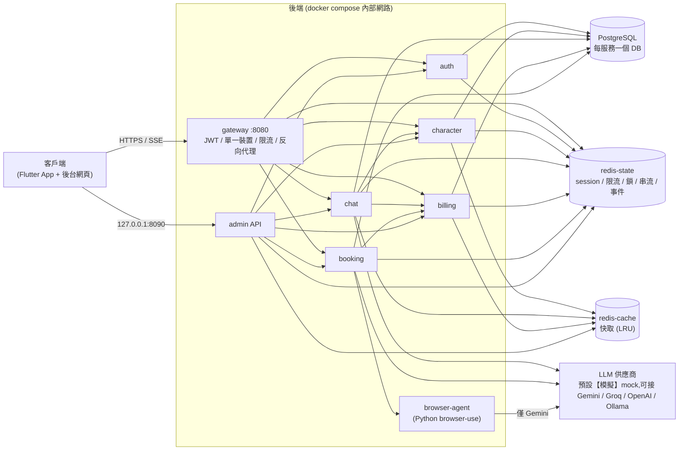
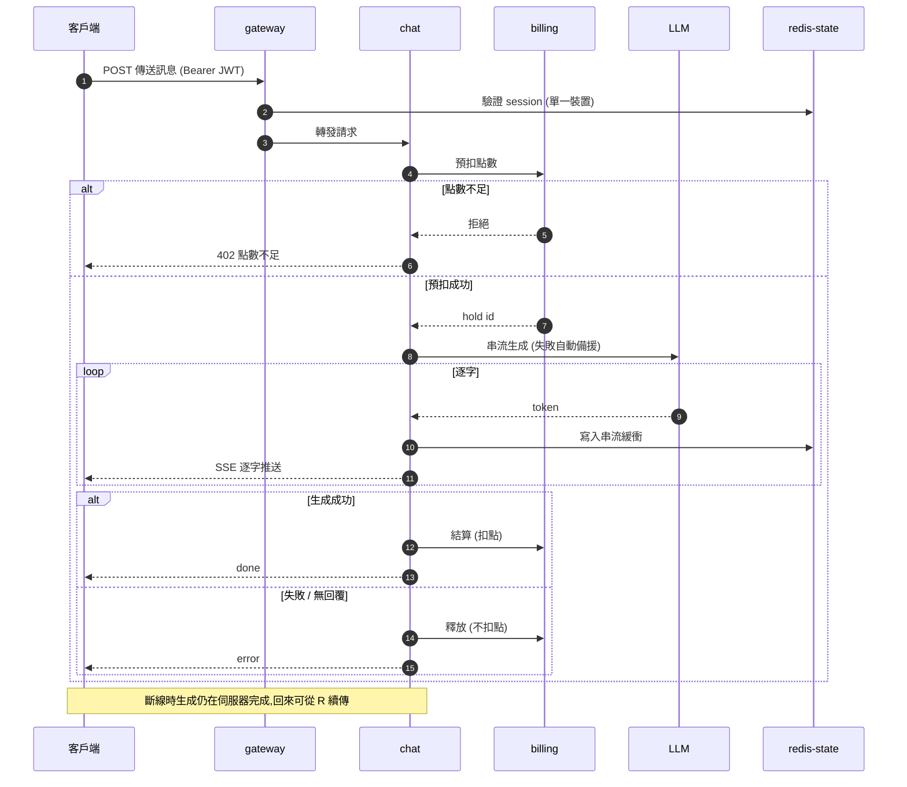
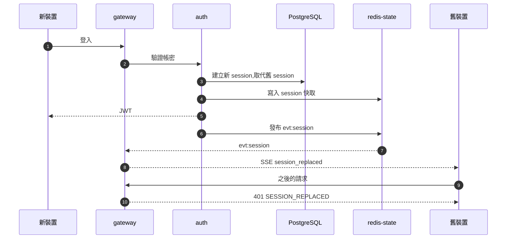
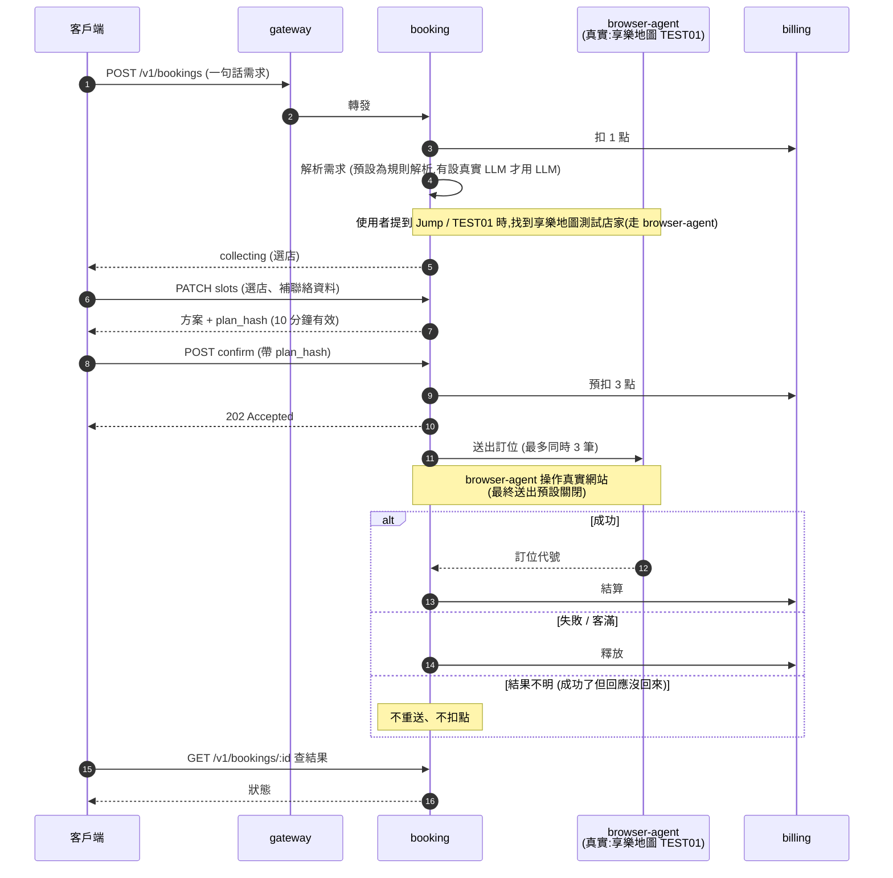

# 後端架構圖與循序圖

App 與後台合併為「客戶端」。

## 系統架構圖

```mermaid
flowchart LR
    Client["客戶端<br/>(Flutter App + 後台網頁)"]

    subgraph Backend["後端 (docker compose 內部網路)"]
        GW["gateway :8080<br/>JWT / 單一裝置 / 限流 / 反向代理"]
        AUTH["auth"]
        CHAR["character"]
        CHAT["chat"]
        BILL["billing"]
        BOOK["booking"]
        BA["browser-agent<br/>(Python browser-use)"]
        ADMIN["admin API"]
    end

    LLM["LLM 供應商<br/>預設【模擬】mock,可接 Gemini / Groq / OpenAI / Ollama"]
    PG[("PostgreSQL<br/>每服務一個 DB")]
    RS[("redis-state<br/>session / 限流 / 鎖 / 串流 / 事件")]
    RC[("redis-cache<br/>快取 (LRU)")]

    Client -- "HTTPS / SSE" --> GW
    Client -- "127.0.0.1:8090" --> ADMIN
    GW --> AUTH
    GW --> CHAR
    GW --> CHAT
    GW --> BOOK
    GW --> BILL
    CHAT --> BILL
    CHAT --> CHAR
    CHAT --> LLM
    BOOK --> BILL
    BOOK --> LLM
    BOOK --> BA
    BA -- "僅 Gemini" --> LLM
    ADMIN --> AUTH
    ADMIN --> CHAR
    ADMIN --> CHAT
    ADMIN --> BOOK
    ADMIN --> BILL

    AUTH & CHAR & CHAT & BILL & BOOK --> PG
    GW & AUTH & CHAR & CHAT & BILL & BOOK & ADMIN --> RS
    CHAR & CHAT & BILL & ADMIN --> RC
```

## 循序圖 1:聊天串流(預扣 → 結算/釋放)

```mermaid
sequenceDiagram
    autonumber
    participant C as 客戶端
    participant GW as gateway
    participant CH as chat
    participant B as billing
    participant L as LLM
    participant R as redis-state

    C->>GW: POST 傳送訊息 (Bearer JWT)
    GW->>R: 驗證 session (單一裝置)
    GW->>CH: 轉發請求
    CH->>B: 預扣點數
    alt 點數不足
        B-->>CH: 拒絕
        CH-->>C: 402 點數不足
    else 預扣成功
        B-->>CH: hold id
        CH->>L: 串流生成 (失敗自動備援)
        loop 逐字
            L-->>CH: token
            CH->>R: 寫入串流緩衝
            CH-->>C: SSE 逐字推送
        end
        alt 生成成功
            CH->>B: 結算 (扣點)
            CH-->>C: done
        else 失敗 / 無回覆
            CH->>B: 釋放 (不扣點)
            CH-->>C: error
        end
    end
    Note over C,CH: 斷線時生成仍在伺服器完成,回來可從 R 續傳
```

## 循序圖 2:單一裝置登入

```mermaid
sequenceDiagram
    autonumber
    participant N as 新裝置
    participant GW as gateway
    participant A as auth
    participant DB as PostgreSQL
    participant R as redis-state
    participant O as 舊裝置

    N->>GW: 登入
    GW->>A: 驗證帳密
    A->>DB: 建立新 session,取代舊 session
    A->>R: 寫入 session 快取
    A-->>N: JWT
    A->>R: 發布 evt:session
    R-->>GW: evt:session
    GW-->>O: SSE session_replaced
    O->>GW: 之後的請求
    GW-->>O: 401 SESSION_REPLACED
```

## 循序圖 3:AI 代辦訂位

```mermaid
sequenceDiagram
    autonumber
    participant C as 客戶端
    participant GW as gateway
    participant BK as booking
    participant J as browser-agent<br/>(真實:享樂地圖 TEST01)
    participant B as billing

    C->>GW: POST /v1/bookings (一句話需求)
    GW->>BK: 轉發
    BK->>B: 扣 1 點
    BK->>BK: 解析需求 (預設為規則解析,有設真實 LLM 才用 LLM)
    Note over BK,J: 使用者提到 Jump / TEST01 時,找到享樂地圖測試店家(走 browser-agent)
    BK-->>C: collecting (選店)
    C->>BK: PATCH slots (選店、補聯絡資料)
    BK-->>C: 方案 + plan_hash (10 分鐘有效)
    C->>BK: POST confirm (帶 plan_hash)
    BK->>B: 預扣 3 點
    BK-->>C: 202 Accepted
    BK->>J: 送出訂位 (最多同時 3 筆)
    Note over BK,J: browser-agent 操作真實網站<br/>(最終送出預設關閉)
    alt 成功
        J-->>BK: 訂位代號
        BK->>B: 結算
    else 失敗 / 客滿
        BK->>B: 釋放
    else 結果不明 (成功了但回應沒回來)
        Note over BK: 不重送、不扣點
    end
    C->>BK: GET /v1/bookings/:id 查結果
    BK-->>C: 狀態
```
